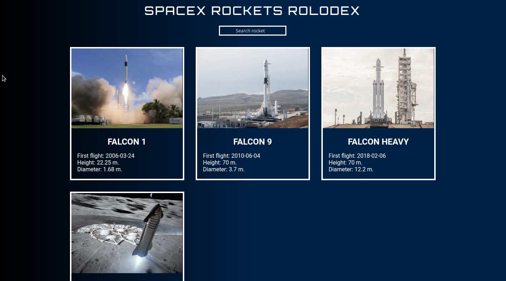

# [SpaceX Rockets Rolodex](https://ranayas.github.io/spacex-rockets-rolodex)

Proyecto hecho con [React](https://github.com/facebook/react) el cual consume la [API de SpaceX](https://github.com/r-spacex/SpaceX-API)
y realiza un filtro para buscar cohetes por nombre.

## Stack

- [React](https://github.com/facebook/react).
- Proyecto generado con [create-react-app](https://github.com/facebook/create-react-app).
- Peticiones a la [API de SpaceX](https://github.com/r-spacex/SpaceX-API) con fetch.
- Estilos con CSS.

## Instalación

1. Clona este repositorio.  
`git clone https://github.com/ranayas/spacex-rockets-rolodex`

2. Cambia de directorio a spacex-rockets-rolodex.  
`cd spacex-rockets-rolodex`

3. Instala las dependencias necesarias.  
`npm install` o `yarn`

## Servidor

### Desarrollo

Ejecuta `npm start` o `yarn start`.

### Producción

Ejecuta `npm run build` o `yarn build` para generar la carpeta `build` la cual
contiene los archivos estáticos para subir al servidor web.
